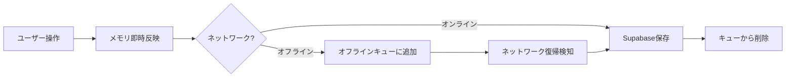
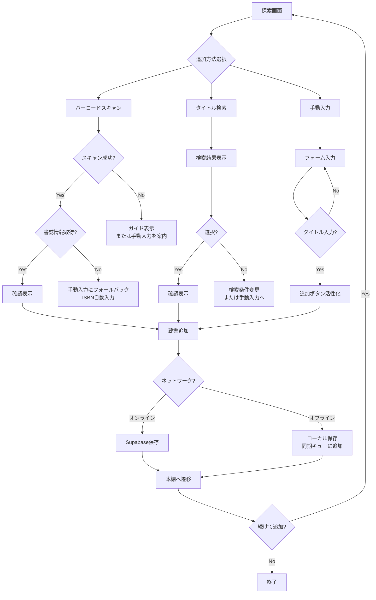

# 📜 ツンドクエスト UX分析書 — Phase 2-4 ユーザー体験設計

> 作成日: 2026-05-08
> 分析対象: tsundoku-quest-flutter (Supabase Phase 2-4)
> テーマ: 積読管理 × RPGダンジョン探索

---

## 目次
1. [蔵書追加フローの最適なUI](#1-蔵書追加フローの最適なui)
2. [バーコードスキャン画面のUX](#2-バーコードスキャン画面のux)
3. [蔵書管理の操作感](#3-蔵書管理の操作感)
4. [検索・推薦の表示方法](#4-検索推薦の表示方法)
5. [オフライン時の挙動](#5-オフライン時の挙動)
6. [エラー表示のUX](#6-エラー表示のux)

---

## 0. 現状分析サマリー

コードベース分析の結果、以下の状態が確認された：

| 要素 | 現状 | 備考 |
|------|------|------|
| 本棚画面 | ✅ 実装済み | セクション分割（読書中/積読/読了）、スワイプ削除、編集モーダル |
| 探索画面 | ✅ 部分実装 | 3タブ構成（検索/スキャン/手入力）、スキャン機能実装済み |
| 読書中画面 | ✅ 実装済み | タイマー、ページ管理、読了フロー |
| 足跡画面 | ✅ 実装済み | 統計グリッド、カレンダー、レベル表示 |
| Supabase連携 | ✅ 実装済み | 透過型ハイブリッド（メモリ即時反映＋非同期永続化） |
| ゲストファースト | ✅ 実装済み | 匿名ユーザーIDフォールバック |
| エラーハンドリング | ⚠️ 基本実装 | ErrorBoundary + SnackBar、但しユーザー向けメッセージ改善余地あり |
| 検索機能 | ⚠️ プロバイダまで実装 | UIの検索結果表示は未実装（TODO残） |
| 推薦機能 | ❌ 未実装 | Phase 4 対象 |
| オフライン検知 | ❌ 未実装 | ネットワーク状態の明示的なUI表示なし |

---

## 1. 蔵書追加フローの最適なUI

### 1.1 現状の導線

探索画面（`ExploreScreen`）は3つのタブを水平に並べている：
```
[ 🔍 検索 ] [ 📷 スキャン ] [ ✏️ 手入力 ]
```

### 1.2 問題点

1. **3択がフラット** — どの方法が「推奨」かユーザーに伝わらない
2. **登録後のフィードバックが弱い** — スキャン成功時に即座に本棚に遷移（コンテキスト断絶）
3. **手入力が3番目** — 「タイトルだけ入れたい」ユーザーに3タップを強いる

### 1.3 推奨設計

#### 推奨導線: 「スキャン優先・手入力は補完」

```
探索画面（初回）:
┌─────────────────────────────┐
│  📷 バーコードをスキャン      │ ← 最前面・最大面積
│  [ カメラプレビュー ]        │
│  ─── または ───              │
│  🔍 タイトルで検索            │ ← ボタンで切替
│  ✏️ 手動で入力                │ ← 一番小さいリンク
└─────────────────────────────┘
```

**タブ構成の変更案:**

| 案 | 方式 | メリット | デメリット |
|----|------|---------|-----------|
| **A (推奨)** | スキャンをデフォルト表示、下部に「検索」「手入力」の補助リンク | スキャンへの心理的ハードル低下、画面がすっきり | タブ切替の習慣が崩れる |
| B | 現在の3タブを維持し、順序を「スキャン→検索→手入力」に変更 | 最小変更 | 依然として3択の認知負荷 |
| C | FABボタン方式：「+」→ スキャン/検索/手入力の選択肢 | 本棚画面からの導線が明確 | 探索画面の役割が曖昧に |

**推奨: 案A（スキャン優先表示）**

理由:
- 積読管理アプリの主要ユースケースは「手持ちの本を登録」→ バーコードスキャンが最速
- 3タブを横並びにすると1タブあたりの横幅が狭くなり、タッチターゲットが小さくなる
- ゲストファースト: 初回ユーザーが「とりあえずスキャンしてみよう」と思える導線が重要

#### 手入力フォームの改善

現在の手入力フォームは3フィールド（タイトル* / 著者 / ISBN）。以下の改善を推奨:

```
┌─────────────────────────────┐
│ ✏️ 本を手動で追加           │
│                             │
│ 📘 タイトル *              │ ← 必須、最初にフォーカス
│  [________________________] │
│                             │
│ ✍️ 著者                    │
│  [________________________] │ カンマ区切りで複数対応
│                             │
│ 🔢 ISBN                    │ ← 入力すると自動で書誌情報補完（任意）
│  [________________________] │
│                             │
│ 📖 ページ数                 │ ← 追加推奨（進捗率計算に必須）
│  [________________________] │
│                             │
│ 媒体: [物理📖 / 電子📱 / 🎧] │ ← 初期値「物理」でデフォルト
│                             │
│ [📚 書庫に追加]              │
└─────────────────────────────┘
```

**追加すべきフィールド:**
- **ページ数** — 現在の `Book` モデルに `pageCount` は存在するが、手入力フォームにない。進捗率計算に不可欠。
- **媒体選択** — `BookMedium` はモデルにあるが、手入力フォームでの選択がない。

#### 登録完了後のフロー改善

現在: スキャン成功 → 即座に本棚へ遷移（`context.go('/')`）

推奨:
```
スキャン成功 → ✅ 確認画面（1.5秒表示）→ 本棚画面（該当セクションまでスクロール）
                            ↓
                      「続けて追加」ボタン → スキャン画面に戻る
```

実装イメージ:
```dart
// 確認オーバーレイ（スキャン成功時）
ScaffoldMessenger.of(context).showSnackBar(
  SnackBar(
    content: Row(
      children: [
        const Text('✅ '),
        Expanded(child: Text('「${book.title}」を積読に追加しました')),
      ],
    ),
    action: SnackBarAction(
      label: '続けて追加',
      onPressed: () {}, // スキャン画面に留まる
    ),
    duration: const Duration(seconds: 3),
  ),
);
// 3秒後に本棚へ
await Future.delayed(const Duration(seconds: 3));
if (mounted) context.go('/');
```

---

## 2. バーコードスキャン画面のUX

### 2.1 現状評価

| 項目 | 現状 | 評価 |
|------|------|------|
| カメラ起動 | `MobileScanner` ウィジェットで即時表示 | ✅ 良い |
| パーミッション | 初回はOS標準ダイアログ | ⚠️ 未ハンドリング |
| スキャン中フィードバック | 下部に「検索中...」インジケータ | ✅ 基本OK |
| 重複検知 | 2500msデバウンス | ✅ 良い |
| エラー時 | SnackBar表示＋1.5s待機 | ⚠️ 改善余地 |
| スキャン範囲ガイド | テキストのみ「枠内にバーコードをかざしてください」 | ❌ 視覚的ガイドなし |

### 2.2 推奨設計

#### 初回パーミッション体験

```
[初回探索画面表示]
    ↓
カメラパーミッション未付与？
    ├── Yes → パーミッションリクエスト
    │         ├── 許可 → スキャンタブ表示
    │         └── 拒否 → 「カメラへのアクセスが必要です」説明表示
    │                   + [手動入力を試す] ボタン（手入力タブへ誘導）
    └── No  → 通常表示
```

**パーミッション拒否時のUI:**

```
┌─────────────────────────────┐
│  📷 カメラへのアクセスが必要 │
│                             │
│  バーコードをスキャンする    │
│  ためにカメラ許可が必要です  │
│                             │
│  🔧 [設定から許可する]      │ ← OS設定へ
│  ✏️ [手動で入力する]       │ ← 手入力タブへ切替
└─────────────────────────────┘
```

**実装のポイント:**
- `Permission.camera().status` を事前チェック
- 拒否後はOS設定画面へ誘導（`openAppSettings()`）
- パーミッション未許可時はスキャンタブを選択できないようにグレーアウトでも良い
- 初回は「なぜカメラが必要か」の説明を表示してからリクエスト（iOSのプライバシー感度考慮）

#### スキャン中の視覚的フィードバック

現在は下部テキストのみ。以下の視覚要素を追加推奨:

```
┌─────────────────────────────┐
│  ┌───────────────────────┐  │
│  │                       │  │
│  │   [    📷    ]        │  │ ← カメラプレビュー
│  │   ┌─────────────┐    │  │
│  │   │  枠に合わせて  │    │  │ ← スキャン範囲ガイド（緑枠）
│  │   │  ください     │    │  │
│  │   └─────────────┘    │  │
│  │                       │  │
│  └───────────────────────┘  │
│                             │
│  検出中... 🔍              │ ← スキャン中のアニメーション
│  ─────────────────────      │
│  [💡 バーコードを枠内に      │
│   入れてください]           │ ← ヒントテキスト
└─────────────────────────────┘
```

**スキャン範囲ガイド:** 半透明のオーバーレイ＋中央に枠線。`mobile_scanner` の `ScanWindow` を活用。

**スキャン成功時:** バイブレーション（`HapticFeedback.mediumImpact()`）＋枠線が緑に変化＋チェックマークアニメーション

#### スキャン失敗時のリカバリーフロー

現在の流れ:
```
スキャン検出 → ISBN検索 → 見つからない → SnackBar「本が見つかりませんでした」→ 1.5s待機 → スキャン再開
```

推奨する失敗時フロー:

```
スキャン検出 → ISBN検索
    ├── 成功 → ✅ 確認表示 → 本棚へ（または続けて追加）
    ├── 見つからない → 確認ダイアログ表示
    │                    ├── ❌ もう一度スキャン → スキャン再開
    │                    └── ✏️ 手動で入力 → 手入力フォーム（ISBN自動入力済み）
    └── ネットワークエラー → SnackBar「通信エラーが発生しました」
                              └── ✏️ 手動で入力するリンク
```

**実装イメージ:**

```dart
Future<void> _onBarcodeDetected(String? rawValue) async {
  if (_isScanning || rawValue == null || rawValue.isEmpty) return;

  // デバウンス
  if (_isDebounced(rawValue)) return;

  setState(() => _isScanning = true);
  // バイブレーション
  HapticFeedback.mediumImpact();

  try {
    final book = await _searchService.lookupByIsbn(rawValue);
    if (book != null && mounted) {
      _onScanSuccess(book);
    } else if (mounted) {
      _onScanNotFound(rawValue);
    }
  } catch (e) {
    if (mounted) _onScanError(e, rawValue);
  } finally {
    if (mounted) setState(() => _isScanning = false);
  }
}

void _onScanNotFound(String isbn) {
  showDialog(
    context: context,
    builder: (ctx) => AlertDialog(
      title: const Text('🔍 本が見つかりません'),
      content: Text('ISBN: $isbn の本はデータベースに見つかりませんでした。'),
      actions: [
        TextButton(
          onPressed: () => Navigator.pop(ctx),
          child: const Text('もう一度スキャン'),
        ),
        TextButton(
          onPressed: () {
            Navigator.pop(ctx);
            // 手入力タブに切り替え、ISBNを自動入力
            _switchToManualTab(isbn: isbn);
          },
          child: const Text('手動で入力'),
        ),
      ],
    ),
  );
}
```

#### スキャンボタンの手動トリガー

常時スキャン検出に加えて、**手動シャッターボタン**を追加することを推奨。理由:
- バーコードがかすれている場合、長押しでピント調整してから撮影したい
- ユーザーに「今スキャンしている」という能動感を与える
- フラッシュライトのON/OFFも同エリアに配置可能

```
┌─────────────────────────────┐
│  [カメラプレビュー]          │
│                             │
│         [⚪] ← シャッターボタン │
│      💡 [フラッシュ]         │
└─────────────────────────────┘
```

---

## 3. 蔵書管理の操作感

### 3.1 現状評価

| 操作 | 実装 | 評価 |
|------|------|------|
| スワイプ削除 | ✅ `Dismissible` + 確認ダイアログ | ✅ 良い |
| 編集 | ✅ `PopupMenuButton` → `EditBookModal` (BottomSheet) | ⚠️ 改善余地 |
| ステータス変更 | ✅ 編集モーダル内でSegmentedButton | ✅ OK |
| 並び替え | ❌ なし | — |
| 一括操作 | ❌ なし | — |

### 3.2 推奨設計

#### 3.2.1 スワイプアクションの拡張

現在は「右→左スワイプで削除」のみ。以下の拡張を推奨:

```
┌─────────────────────────────────┐
│  📘 タイトル                     │
│  ✍️ 著者名                      │
│  [====▰▰▰▰▰▰▰▰▰===] 60%       │
│                                 │
│  左スワイプ → 🗑️ 削除          │ ← 現在
│  右スワイプ → ✅ 読了 / 📖 読書中 │ ← 追加推奨
│  長押し     → ✏️ 編集モーダル    │ ← 追加推奨
└─────────────────────────────────┘
```

**推奨スワイプ設計:**

| 方向 | 動作 | 確認 | 備考 |
|------|------|------|------|
| ← (右→左) | 削除 | ✅ 確認ダイアログ | 現状維持 |
| → (左→右) | ステータス変更 | ❌ なし（元に戻せる） | 積読→読書中→読了 と循環 |
| 長押し | 編集モーダル | — | 現在は3点リーダーメニュー |

**ステータススワイプの循環ルール:**
```
tsundoku → reading → completed → tsundoku
  (待機中)   (読書中)   (読了)
```

実装イメージ:
```dart
Dismissible(
  key: ValueKey('book_${book.id}'),
  // 削除（左スワイプ）
  dismissThresholds: const {DismissDirection.endToStart: 0.4},
  secondaryBackground: Container(
    alignment: Alignment.centerRight,
    padding: const EdgeInsets.only(right: 24),
    color: Colors.red,
    child: const Icon(Icons.delete, color: Colors.white),
  ),
  confirmDismiss: (direction) async {
    if (direction == DismissDirection.endToStart) {
      return _confirmDelete(context); // 削除確認
    }
    return true; // ステータス変更は即時反映
  },
  onDismissed: (direction) {
    if (direction == DismissDirection.endToStart) {
      onDelete?.call();
    } else {
      onStatusChange?.call(); // 次のステータスへ
    }
  },
  // ステータス変更（右スワイプ）
  background: Container(
    alignment: Alignment.centerLeft,
    padding: const EdgeInsets.only(left: 24),
    color: AppTheme.readingColor,
    child: const Icon(Icons.menu_book, color: Colors.white),
  ),
  child: /* BookCard内容 */,
);
```

#### 3.2.2 カード情報密度

現在のBookCardは以下の情報を表示:
- 表紙プレースホルダー（48x64）
- タイトル（1行）
- 著者（1行）
- 進捗バー（読書中のみ）
- ステータスバッジ
- 3点リーダーメニュー

**推奨する情報密度:**

| 画面幅 | 表示情報 | 備考 |
|--------|---------|------|
| デフォルト | 表紙＋タイトル＋著者＋進捗バー＋ステータス | 現状維持 |
| 読了本 | 表紙＋タイトル＋評価(★)＋読了日 | 星評価をカードに表示 |
| コンパクトモード | タイトル＋進捗のみ | 将来オプション |

**具体的な改善ポイント:**

1. **表紙画像の表示** — 現在はアイコンプレースホルダーのみ。`book.coverImageUrl` が存在する場合は `CachedNetworkImage` で表示する
2. **読了本の星評価をカードに表示** — 編集モーダルを開かなくても評価が見えるように
3. **進捗バーのパーセンテージ表示** — バーの右側に「60%」とテキスト表示

```dart
// BookCard 改善案
Container(
  child: Row(
    children: [
      // 表紙（CachedNetworkImage対応）
      book.coverImageUrl != null
        ? ClipRRect(
            borderRadius: BorderRadius.circular(4),
            child: CachedNetworkImage(
              imageUrl: book.coverImageUrl!,
              width: 48, height: 64,
              fit: BoxFit.cover,
              placeholder: (_, __) => _coverPlaceholder(),
              errorWidget: (_, __, ___) => _coverPlaceholder(),
            ),
          )
        : _coverPlaceholder(),
      const SizedBox(width: 12),
      // タイトル・著者
      Expanded(
        child: Column(
          crossAxisAlignment: CrossAxisAlignment.start,
          children: [
            Text(title, maxLines: 1, overflow: TextOverflow.ellipsis),
            if (authors.isNotEmpty)
              Text(authors.join(', '), maxLines: 1, ...),
            const SizedBox(height: 4),
            if (book.status == BookStatus.reading)
              Row(
                children: [
                  Expanded(
                    child: LinearProgressIndicator(value: progress),
                  ),
                  const SizedBox(width: 4),
                  Text('${(progress * 100).toInt()}%',
                    style: const TextStyle(fontSize: 10, color: AppTheme.textSecondary)),
                ],
              ),
            if (book.status == BookStatus.completed && book.rating != null)
              Row(
                children: [
                  ...List.generate(book.rating!, (_) => 
                    const Icon(Icons.star, size: 12, color: AppTheme.badge)),
                ],
              ),
          ],
        ),
      ),
      // ステータス＋メニュー
      Column(
        children: [
          _statusBadge,
          _popupMenu,
        ],
      ),
    ],
  ),
);
```

#### 3.2.3 編集モーダルの改善

現在の `EditBookModal` はBottomSheetで表示され、以下の編集が可能:
- 媒体選択（SegmentedButton）
- 読書状態選択（SegmentedButton）
- 評価（5つ星）
- メモ（テキストフィールド）

**改善推奨:**
1. **現在のページ数入力フィールド追加** — 読書中の場合、進捗を直接数値入力できるように
2. **読了日/開始日の表示** — 読了本には読了日を表示し、編集可能に
3. **削除ボタンをモーダル下部に配置** — 3点メニューからではなく、編集モーダルからも削除できるように（確認ダイアログ付き）
4. **保存ボタンのフィードバック** — 保存成功時にSnackBarでフィードバック

---

## 4. 検索・推薦の表示方法

### 4.1 現状評価

- **検索**: `bookSearchServiceProvider` は実装済み（楽天→OpenBD→GoogleBooksの3段フォールバック）
- **検索UI**: `TextField` はあるが、`onSubmitted` の処理が `// TODO` のまま
- **推薦**: 未実装

### 4.2 推奨設計

#### 4.2.1 検索結果の表示形式

**推奨: カードUI（リスト）**

```
┌─────────────────────────────┐
│ 🔍 [検索ワードを入力...]     │ ← 検索バー（画面上部固定）
│                             │
│ 検索結果（3件）              │
│ ┌─────────────────────┐    │
│ │ 📘 タイトル          │ ← 検索結果カード
│ │ ✍️ 著者名           │    [➕ 追加]
│ │ ⭐ 楽天 4.2         │
│ ├─────────────────────┤    │
│ │ 📘 タイトル2         │
│ │ ✍️ 著者名2          │    [➕ 追加]
│ └─────────────────────┘    │
│                             │
│ [もっと見る]                │ ← ページネーション
└─────────────────────────────┘
```

**カードの構成要素:**
- 表紙サムネイル（左）
- タイトル（太字、1〜2行）
- 著者名（1行）
- 出版社／発行日（小さく）
- 「追加」ボタン（右端）

**「追加」ボタンの動作:**
1. タップで即座に積読として追加
2. ボタンが ✅ 追加済み に変化
3. アニメーション付きでカードが縮小消滅（オプション）

**代替案比較:**

| 方式 | メリット | デメリット |
|------|---------|-----------|
| **カードリスト（推奨）** | 情報量が多い、タップしやすい | 表示件数が少ない |
| シンプルリスト | 多くの結果を表示可能 | 表紙や詳細情報が不足 |
| グリッド | 視覚的に探索しやすい | テキスト情報が読み取りにくい |

#### 4.2.2 検索のUXフロー

```
[検索バーにフォーカス]
    ↓
┌─ 最近の検索履歴 ─────────┐ ← 検索履歴表示（ローカル保存）
│ 🔍 「人間失格」            │
│ 🔍 「プログラミング」       │
└──────────────────────────┘
    ↓ 文字入力
┌─ 検索候補 ───────────────┐ ← インクリメンタルサーチ
│ 📘 人間失格                │
│ 📘 人間の条件              │
└──────────────────────────┘
    ↓ Enter / 候補タップ
検索中... [インジケータ]
    ↓
結果表示（カードリスト）
    ↓ 結果なし
「見つかりませんでした」
  [✏️ 手動で入力する]
```

**デバウンス:** 300ms（300ms以上入力を止めたら検索開始）

#### 4.2.3 「次に読む本」推薦

推薦ロジック（Phase 4）の表示デザイン:

```
本棚画面（トップ）:
┌─────────────────────────────┐
│ ⚔️ Lv.5 古文書ハンター       │
│ [████████░░░░░░] 120/200 XP │
│                             │
│ 🔥 3日連続読書中！          │
│                             │
│ 📖 今日のクエスト            │
│ [冒険を始める]              │
│                             │
│ ┌─ 🎯 おすすめ ─────────┐  │ ← 推薦セクション
│ │ 📘 人間失格             │  │
│ │   太宰治                │  │
│ │   あなたの積読にぴったり! │  │
│ │ [読書を始める]           │  │
│ └────────────────────────┘  │
│                             │
│ [▼] 探索中（2冊）           │ ← 既存セクション
│ [▼] 待機中の冒険（5冊）     │
└─────────────────────────────┘
```

**推薦カードのデザイン原則:**
1. **常に1枚表示** — 複数推薦は「次へ」スワイプで巡回
2. **推薦理由を明示** — 「積読が3ヶ月以上」「同じ著者の本を読了」「ジャンル未読」
3. **アクションは1つ** — 「読書を始める」のみ（詳細は本を開いてから）
4. **スキップ可能** — 「いらない」スワイプ or 閉じるボタン

**推薦の表示条件:**
- 積読（tsundoku）状態の本が1冊以上ある
- 最後に本を追加してから3日以上経過（または未読）

---

## 5. オフライン時の挙動

### 5.1 現状評価

| 機能 | オフライン時の挙動 | 評価 |
|------|-------------------|------|
| 蔵書一覧表示 | メモリキャッシュがあれば表示可 | ⚠️ 永続キャッシュなし |
| 蔵書追加 | メモリのみ（Supabase保存は失敗） | ⚠️ SnackBarで通知 |
| 読書セッション | ローカルで動作 | ✅ 問題なし |
| バーコードスキャン | ISBN検索が失敗 | ❌ エラーハンドリングのみ |
| 探索(検索) | API依存のため機能しない | ❌ エラーハンドリングのみ |

### 5.2 推奨設計

#### 5.2.1 ネットワーク状態の可視化

```dart
// connectivity_plus パッケージで常時監視
final connectivityProvider = StreamProvider<bool>((ref) {
  return Connectivity().onConnectivityChanged.map(
    (result) => result != ConnectivityResult.none,
  );
});
```

**UIでの表現:**

```
オフライン時:
┌─────────────────────────────┐
│ ⚠️ オフライン               │ ← 画面上部に細いバナー
│   変更は端末内のみ保存されます │
│                             │
│ [通常の本棚表示]             │ ← ローカルデータは表示可能
│                             │
│ 📷 [スキャン]                │ ← 利用可能（ただし検索失敗の可能性を表示）
│ 🔍 [検索]                    │ ← 「オフラインのため検索できません」と表示
└─────────────────────────────┘
```

**バナーの状態:**
```
オンライン復帰時:
┌─────────────────────────────┐
│ ✅ 同期完了                  │ ← 緑バナー（3秒で自動消去）
│   3件の変更をSupabaseに保存  │
└─────────────────────────────┘
```

#### 5.2.2 オフラインで使える機能マトリックス

| 機能 | オンライン | オフライン | 備考 |
|------|-----------|-----------|------|
| 本棚表示（キャッシュ済み） | ✅ | ✅ | メモリ＋ローカルDB（Hive等）に永続化 |
| 読書タイマー/進捗更新 | ✅ | ✅ | ローカルで完結 |
| 蔵書追加（手入力） | ✅ | ✅ → ⚠️ | ローカル保存＋後で同期 |
| 蔵書編集/削除 | ✅ | ✅ → ⚠️ | 同上 |
| バーコードスキャン | ✅ | ⚠️ | スキャンは可能、検索は失敗の可能性を表示 |
| 書誌情報検索 | ✅ | ❌ | API依存のため不可 |
| 推薦表示 | ✅ | ❌ | オフライン時は非表示 |

#### 5.2.3 オフラインキュー実装方針

現在の `BookDataNotifier` は「即時メモリ反映＋非同期Supabase保存」の透過型ハイブリッド。これを拡張:



**推奨するローカル永続化手段:**
- **短期（セッション内）**: 現在のインメモリで十分
- **長期（アプリ再起動後）**: `shared_preferences` で最低限（最終状態のみ）または `sqflite` / Hive で本格同期キュー
- **初期実装としては**: `shared_preferences` にJSONシリアライズして最終状態を保存する「簡易永続化」でスタート

```dart
// 簡易オフラインキュー実装イメージ
class OfflineSyncQueue {
  final List<SyncOperation> _queue = [];

  void enqueue(SyncOperation op) {
    _queue.add(op);
    _persistQueue();
    _tryProcess();
  }

  Future<void> _tryProcess() async {
    final isOnline = await checkConnectivity();
    if (!isOnline) return;

    while (_queue.isNotEmpty) {
      final op = _queue.first;
      try {
        await op.execute();
        _queue.removeAt(0);
        _persistQueue();
      } catch (e) {
        break; // 失敗したら一旦停止
      }
    }
  }
}
```

#### 5.2.4 手入力のオフライン動作

手動入力は**オフラインでも完全動作**させるべき。理由:
- ユーザーが最も「その場で登録したい」のは書店や図書館で手に取った本
- タイトルさえ分かれば登録可能（書誌情報の補完は後から）
- ゲストファースト＋オフラインファーストの精神

```
手入力（オフライン）:
タイトル: 【必須】 ← これだけで登録可能
著者: 【任意】
ISBN: 【任意】
ページ数: 【任意】

保存 → ローカルに保存 → 「オフライン — 後で同期されます」表示
```

---

## 6. エラー表示のUX

### 6.1 現状評価

| エラー種別 | 現在の処理 | 評価 |
|-----------|-----------|------|
| Supabase初期化失敗 | `debugPrint` + オフラインモード継続 | ⚠️ ユーザーに伝わらない |
| 蔵書取得失敗 | `errorMessage` State更新 | ⚠️ UIに表示されていない |
| Supabase保存失敗 | SnackBar「Supabase保存失敗（端末内のみ反映）」 | ⚠️ メッセージが技術的 |
| 検索エラー | SnackBar「🔌 検索エラー: $e」 | ❌ 生のエラー表示 |
| スキャン失敗 | SnackBar「本が見つかりませんでした」 | ✅ 適切 |
| Flutterフレームワークエラー | ErrorBoundaryWidget表示 | ✅ |

### 6.2 推奨設計

#### 6.2.1 エラーレベル定義

| レベル | 表示方法 | 例 |
|--------|---------|----|
| 🟢 情報 | Inline toast / バッジ | 「3件同期しました」 |
| 🟡 警告 | Inlineバナー＋アイコン | 「オフラインです」 |
| 🟠 エラー | SnackBar（アクション付き） | 「保存に失敗しました [再試行]」 |
| 🔴 致命的 | ErrorBoundary（リロードボタン付き） | 「予期せぬエラーが発生しました」 |

#### 6.2.2 エラーメッセージの設計原則

1. **ユーザー言語で書く** — 「Supabase保存失敗」ではなく「保存に失敗しました」
2. **原因＋対策をセット** — 「ネットワークに接続できません。Wi-Fiを確認してください」
3. **アクションを提供** — 可能な限り「再試行」「手動入力に切り替え」等のボタンを付与
4. **技術的詳細は隠す** — エラーコード等はデバッグログのみ

#### 6.2.3 エラー種別ごとのUI設計

##### Supabase接続エラー

```
シナリオ: Supabaseがダウンしている、またはネットワーク不通

初回ロード時:
┌─────────────────────────────┐
│  📚 書庫                     │
│                             │
│ ┌─────────────────────┐    │
│ │ ⚠️ データの取得に     │    │
│ │  失敗しました        │    │
│ │                     │    │
│ │ [🔄 再試行]          │    │
│ │ [✏️ オフラインで続ける]│    │
│ └─────────────────────┘    │
└─────────────────────────────┘
```

**API制限エラー（レートリミット）:**

```
シナリオ: 楽天API等のレートリミット超過

┌─────────────────────────────┐
│ 検索中...                    │
│                             │
│ ⏳ 少し待ってから再試行       │
│ してください                 │
│                             │
│ [🔄 再試行] [✏️ 手動入力]   │
└─────────────────────────────┘
```

**楽天APIのレートリミット対策:**
- エラーハンドリングで `429 Too Many Requests` を検出
- SnackBarで「APIの利用制限に達しました。しばらく待ってからお試しください」
- フォールバック: OpenBD → Google Books の順で自動切替（既に3段フォールバック実装済み）

##### 検索結果ゼロ

```
シナリオ: 検索ワードに該当する本なし

┌─────────────────────────────┐
│ 🔍 [検索ワード]              │
│                             │
│   📭                        │
│ 「検索結果が見つかりません    │
│  でした」                   │
│                             │
│ 検索のヒント:                │
│ • タイトルを短くしてみる     │
│ • ISBNで検索する             │
│                             │
│ [✏️ 手動で登録する]         │
└─────────────────────────────┘
```

##### カメラパーミッション拒否

```
┌─────────────────────────────┐
│  📷                        │
│  カメラへのアクセスが        │
│  許可されていません          │
│                             │
│ 設定からカメラの許可を       │
│ 有効にしてください           │
│                             │
│ [⚙️ 設定を開く]             │
│ [✏️ 手動で入力する]         │
└─────────────────────────────┘
```

#### 6.2.4 ErrorBoundary 改善

現在の `ErrorBoundaryWidget`（`main.dart` で設定）を拡張:

```dart
class ErrorBoundaryWidget extends StatelessWidget {
  final Object error;
  final StackTrace? stackTrace;

  const ErrorBoundaryWidget({
    super.key,
    required this.error,
    this.stackTrace,
  });

  @override
  Widget build(BuildContext context) {
    return Material(
      color: AppTheme.background,
      child: Center(
        child: Padding(
          padding: const EdgeInsets.all(24),
          child: Column(
            mainAxisSize: MainAxisSize.min,
            children: [
              const Text('💥', style: TextStyle(fontSize: 48)),
              const SizedBox(height: 16),
              const Text(
                '予期せぬエラーが発生しました',
                style: TextStyle(
                  fontSize: 18,
                  fontWeight: FontWeight.bold,
                  color: AppTheme.textPrimary,
                ),
              ),
              const SizedBox(height: 8),
              const Text(
                'アプリを再起動するか、'
                '問題が続く場合はお問い合わせください。',
                textAlign: TextAlign.center,
                style: TextStyle(color: AppTheme.textSecondary),
              ),
              const SizedBox(height: 24),
              ElevatedButton.icon(
                onPressed: () {
                  // アプリ再起動
                  SystemNavigator.pop();
                },
                icon: const Icon(Icons.refresh),
                label: const Text('アプリを再起動'),
              ),
            ],
          ),
        ),
      ),
    );
  }
}
```

---

## 7. 総合推奨優先順位

### Phase 2 優先実装項目

| 優先度 | 項目 | 理由 |
|--------|------|------|
| 🔴 P0 | 検索結果表示UIの実装 | 現状TODOのまま、Phase 2の中核機能 |
| 🔴 P0 | 手入力フォームにページ数フィールド追加 | 進捗率計算に必須 |
| 🟡 P1 | スキャン成功時の確認アニメーション＋続けて追加 | ユーザーフィードバック強化 |
| 🟡 P1 | エラーメッセージの日本語改善 | 現在技術的すぎる |
| 🟢 P2 | スキャン失敗時のリカバリーダイアログ | UX改善 |

### Phase 3 優先実装項目

| 優先度 | 項目 | 理由 |
|--------|------|------|
| 🔴 P0 | カメラパーミッションの事前説明＋拒否時ハンドリング | 初回ユーザー体験の要 |
| 🔴 P0 | スキャン範囲ガイド（枠線オーバーレイ） | スキャン成功率向上 |
| 🟡 P1 | スキャン成功時のバイブレーション＋視覚エフェクト | 即時フィードバック |
| 🟡 P1 | フラッシュライトボタン | 暗所での利便性 |
| 🟢 P2 | 手動シャッターボタン | 能動的操作感 |

### Phase 4 優先実装項目

| 優先度 | 項目 | 理由 |
|--------|------|------|
| 🔴 P0 | 推薦セクションの表示（本棚上部） | Phase 4の核心機能 |
| 🟡 P1 | オフライン検知バナー | 状態の可視化 |
| 🟡 P1 | ローカルキャッシュ永続化（Hive/sqflite） | オフラインユーザー体験 |
| 🟢 P2 | 検索履歴＋サジェスト | 検索UXの質向上 |
| 🟢 P2 | オフライン同期キュー | データ整合性 |

---

## 8. 付録: 推奨状態遷移図

### 蔵書追加フロー全体



以上。
